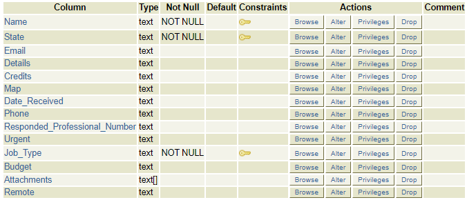
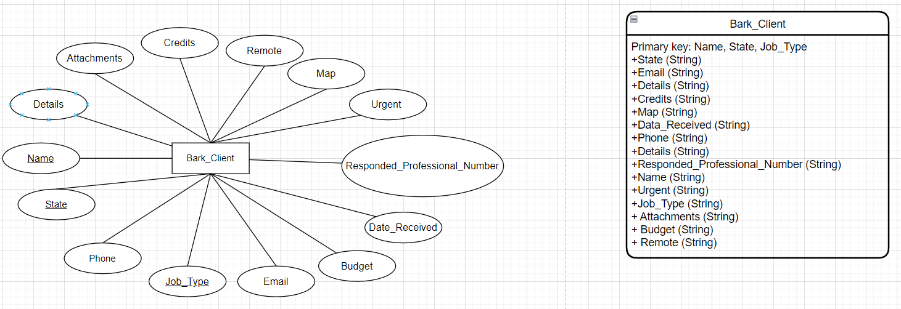

# BARK-Extractor

- `bark_extractor.py`: main app
- `Database.py`: Database class to interact actual database
- `PSTtime.py`: Convert data received time to PST time

## bark_extractor.py

Extract leads from the www.bark.com website and store its data in the postgresql database.

- Change line 76 `numOfclickBtn` variable to control the number of reads to retrieve
  - oneClick = 15 leads
  - `numOfclickBtn = 5`
    - total leads: 15 \* (5 + 1) = 90 leads
  - `numOfclickBtn = 10`
    - total leads: 15 \* (10 + 1) = 165 leads

## Dependencies

- Chrome browser
- `$ python --version`: Python 3.8.5
- `$ pip show selenium`: Version: 4.3.0
- `$ pip show pytz`: Version: 2022.1
- `$ pip show psycopg2`: Version: 2.9.3

## Database_Schema

To change the Epibark_Database_Schema diagram:

1. open www.draw.io
2. Drag and drop `./Database_Schema/Epibark_Database_Schema.drawio` file

## SetUp

1. Download source code by:
   - `$ git clone https://github.com/heeshin174/bark-extractor`
   - Download Zip file
2. Download latest **Python** programming language
   - [Python Download Link](https://www.python.org/downloads/)
3. Install dependencies for project

   - `$ pip install -r requirements.txt` (RECOMMENDED)

     or

   - `$ pip install selenium pytz psycopg2`

4. Download **Chrome browser** on your local computer
5. Check your Chrome browser Version
   - Settings -> About Chrome

6. Google **chrome driver** and download the correct chrome driver that matches your current chrome version.
   - [ChromeDriver Download Link](https://chromedriver.chromium.org/downloads)
7. Replace current `./chromedriver.exe` to your downloaded `./chromedriver.exe`.
8. Run the program by typing `$ python bark_extractor.py` on the terminal

## Usage

- Excute Program: `$ python bark_extractor.py`
  - MacOS: `$ python3 bark_extractor.py`
- Terminate Program: `Ctrl + C`

## POSSIBLE ERRORS

1. Download the wrong **chromedriver**

   - **YOU NEED TO UPDATE THE CHROMEDRIVER IF YOUR CHORME IS UPDATED**
   - Check your operating system and download the corresponding chromedriver
   - check your chrome browser and download the corresponding chromedriver
   - Try other `chromedriver.exe` if something breaks during the execution.
   - `ActionChains` may not work in the wrong chromedriver.

2. Install the wrong version of Python dependencies

   - Follow the installation instructions to have the correct Python dependencies.
   - `$ python --version`: Python 3.8.5
   - `$ pip show selenium`: Version: 4.3.0
   - `$ pip show pytz`: Version: 2022.1
   - `$ pip show psycopg2`: Version: 2.9.3

3. Computer resources are too small and slow to execute the program.

   - Try running the program on another computer that has more resources.

4. Your IP address is not whitelisted by bluehost

   - **MAKE SURE YOUR IP ADDRESS IS WHITELISTED BY BLUEHOST!**
   - **If your IP address is dynamic, you will need to whitelist the changed IP address again.**
   - If your IP address is static, you don't need to whitelist the IP address again.

**PLEASE RESTART THE PROGRAM IF ALL OF THE ABOVE DO NOT APPLY**

## Database

To see the actaul data in the database:

1. open www.bluehost.com
2. login as **epifinder.com** account
   - ask _Robert Yao_ for permission
3. click _Advanced_ -> _phpPgAdmin_ -> _epifinde_EpiBark_ -> _public_ -> _Bark_Client_
4. click _Select_ -> _Select all fields_ -> _Select_
